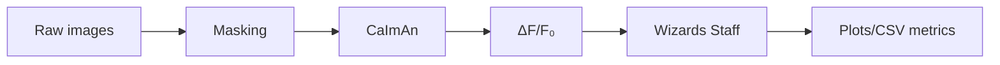

# Lizard Wizard Output Files Guide

This guide explains the output files generated by the Lizard Wizard pipeline and how they flow into Wizards Staff for downstream metrics.

## Table of Contents

- [Visual Pipeline and Data Flow](#visual-pipeline-and-data-flow)
- [Output Directory Structure](#output-directory-structure)
- [Masking Outputs](#masking-outputs)
- [CaImAn Outputs](#caiman-outputs)
- [ΔF/F₀ Calculation Outputs](#δff₀-calculation-outputs)
- [Wizards Staff Outputs](#wizards-staff-outputs)
- [Load Outputs in Python/R](#load-outputs-in-pythonr)
- [Which files do I need?](#which-files-do-i-need)
- [Interpretation Best Practices](#interpretation-best-practices)
- [Common Analysis Workflows](#common-analysis-workflows)

## Visual Pipeline and Data Flow



## Output Directory Structure

The Lizard Wizard pipeline generates a structured output directory:

```text
output_dir/
├── mask/
│   ├── *_masks.tif                   # Masks for each sample
│   ├── *_minprojection.tif           # Minimum projections for visualization
│   └── *_masked-plot.tif             # Visual representation of masks
├── caiman/
│   ├── *_cnm-A.npy                   # Spatial footprints of neurons
│   ├── *_cnm-C.npy                   # Temporal components (calcium activity)
│   ├── *_cnm-S.npy                   # Deconvolved neural activity (spikes)
│   ├── *_cnm-idx.npy                 # Indices of accepted components
│   ├── *_cn-filter.npy/tif           # Correlation images
│   ├── *_pnr-filter.npy/tif          # Peak-to-noise ratio images
│   ├── *_correlation-pnr.png         # Correlation & PNR visualizations
│   ├── *_histogram-pnr-cn-filter.png # Histograms of correlation & PNR
│   ├── *_cnm-traces.png              # Raw calcium traces
│   └── *_cnm-denoised-traces.png     # Denoised calcium traces
├── caiman_calc-dff-f0/
│   ├── *_montage.png                 # Montage of all components
│   ├── *_montage-filtered.png        # Montage of filtered components
│   ├── *_im-st.tif                   # Spatial-temporal image stack
│   ├── *_f-dat.npy                   # Raw fluorescence data
│   ├── *_dff-dat.npy                 # ΔF/F₀ calculated data
│   └── *_df-f0-graph.png             # Visualization of ΔF/F₀ traces
├── wizards-staff/
│   ├── cluster_activity_maps/
│   │   ├── *_activity-overlay.png    # Spatial map of neuron activities
│   │   └── *_clustered-activity-overlay.png # Activity map with clustering
│   ├── cluster_activity_plots/
│   │   └── *_cluster-activity-plot.png # Plot of cluster activities
│   ├── dff_activity_plots/
│   │   └── *_dff-activity-plot.png   # ΔF/F₀ activity plots
│   ├── kmeans_heatmap_plots/
│   │   └── *_kmeans-clustering-plot.png # Clustering heatmaps
│   ├── kmeans_heatmap_csv/
│   │   └── *_clustering-info.csv     # CSV with clustering information
│   ├── rise-time-data.csv            # Rise time metrics
│   ├── fwhm-data.csv                 # FWHM metrics
│   ├── frpm-data.csv                 # Firing rate per minute metrics
│   ├── mask-metrics-data.csv         # Mask shape metrics
│   ├── silhouette-scores-data.csv    # Clustering quality metrics
│   ├── df-mn-pwc.csv                 # Pairwise correlation results
│   ├── df-mn-pwc-intra.csv           # Intra-group correlations
│   └── df-mn-pwc-inter.csv           # Inter-group correlations
├── logs/
│   ├── caiman/
│   ├── mask/
│   ├── moldev-concat/
│   ├── wizards-staff/
│   └── final_summary.*               # Summary report of the analysis
└── metadata.csv                      # Sample metadata
```

## Masking Outputs

The masking step identifies regions of interest (ROIs) in your images:

### Key Files (CaImAn)

- **`*_masks.tif`**: Binary masks identifying the regions containing neurons/cells
- **`*_minprojection.tif`**: Minimum intensity projection for visualizing static structures
- **`*_masked.tif`**: Original image data with the mask applied
- **`*_masked-plot.tif`**: Visualization showing the original projection, masked image, and mask

### Interpretation (Logs)

The masking step is critical as it determines the regions that will be analyzed in subsequent steps. Good masks should:

- Capture the full extent of each organoid/culture
- Have clear boundaries
- Not contain large holes unless they represent actual empty regions

If masking failed, you'll find `*_no-masks.tif` files instead, indicating that the pipeline proceeded without masking.

## CaImAn Outputs

CaImAn identifies and characterizes individual neurons and their calcium signals:

### Key Files

- **`*_cnm-A.npy`**: Spatial footprints of detected neurons (matrix A)
- **`*_cnm-C.npy`**: Temporal calcium traces for each neuron (matrix C)
- **`*_cnm-S.npy`**: Deconvolved spike activity for each neuron
- **`*_cnm-idx.npy`**: Indices of neurons that passed quality control
- **`*_cn-filter.npy/tif`**: Correlation images for neuron detection
- **`*_pnr-filter.npy/tif`**: Peak-to-noise ratio images for signal quality assessment

### Visualization Files (CaImAn)

- **`*_correlation-pnr.png`**: Side-by-side view of correlation and PNR images
- **`*_histogram-pnr-cn-filter.png`**: Histograms showing distribution of correlation and PNR values
- **`*_cnm-traces.png`**: Plots of raw calcium traces for accepted and rejected neurons
- **`*_cnm-denoised-traces.png`**: Plots of denoised calcium traces

### Interpretation (CaImAn)

These files contain the core neuronal data detected by the pipeline:

- High-quality components should have clear spatial footprints in A
- Good temporal components in C should show distinct calcium transients
- The `cnm-idx` file is particularly important as it contains the indices of neurons that passed quality control

## ΔF/F₀ Calculation Outputs

The ΔF/F₀ calculation step normalizes calcium signals to baseline fluorescence:

### Key Files (ΔF/F₀)

- **`*_f-dat.npy`**: Raw fluorescence data for each neuron
- **`*_dff-dat.npy`**: Calculated ΔF/F₀ data (normalized calcium activity)
- **`*_montage.png`**: Montage showing all detected neural components
- **`*_montage-filtered.png`**: Montage showing only components that passed quality control
- **`*_im-st.tif`**: Spatial-temporal image stack for visualizing neuron distributions
- **`*_df-f0-graph.png`**: Graphical representation of ΔF/F₀ traces over time

### Interpretation (ΔF/F₀)

The ΔF/F₀ normalization is essential for comparing calcium activity between different neurons and samples:

- ΔF/F₀ values typically range from 0 to 2-3 for most calcium indicators
- Larger ΔF/F₀ values indicate stronger calcium transients
- The montage visualizations help verify that detected components correspond to actual neurons

## Wizards Staff Outputs

Lizard Wizard nectflow pipeline is integrated with Wizards Staff, a custom image analysis pipeline. Wizards Staff performs advanced analysis on the normalized calcium data and generates:

### Activity Maps (Wizards Staff)

- **`*_activity-overlay.png`**: Spatial map of neuron activities overlaid on the original image
- **`*_clustered-activity-overlay.png`**: Activity map with neurons colored by cluster

### Activity Plots (Wizards Staff)

- **`*_dff-activity-plot.png`**: Stacked ΔF/F₀ traces for all detected neurons
- **`*_cluster-activity-plot.png`**: Average activity of each cluster and detailed plot of the highest-activity cluster

### Clustering Analysis (Wizards Staff)

- **`*_kmeans-clustering-plot.png`**: Heatmap visualization of K-means clustering results
- **`*_clustering-info.csv`**: Detailed information about the clustering results

### Metric Files (Wizards Staff)

- **`rise-time-data.csv`**: Metrics on calcium signal rise times
- **`fwhm-data.csv`**: Full width at half maximum measurements for calcium events
- **`frpm-data.csv`**: Firing rate per minute for each neuron
- **`mask-metrics-data.csv`**: Shape metrics for the ROI masks (roundness, diameter, area)
- **`silhouette-scores-data.csv`**: Quality metrics for clustering

### Correlation Analysis (Wizards Staff)

- **`df-mn-pwc.csv`**: Overall pairwise correlations between neurons
- **`df-mn-pwc-intra.csv`**: Correlations between neurons within the same group
- **`df-mn-pwc-inter.csv`**: Correlations between neurons in different groups

### Interpretation (Wizards Staff)

These files contain the most actionable insights from your calcium imaging data:

- Activity maps show which neurons are most active and their spatial relationships
- Cluster analysis identifies functionally related groups of neurons
- Metric files provide quantitative measures for statistical analysis
- Correlation analysis reveals synchronization patterns between neurons

## Log Files

Each step of the Lizard Wizard and Wizard Staff pipeline generates detailed logs:

### Log Directories

- **`logs/caiman/`**: Logs from the CaImAn processing step
- **`logs/mask/`**: Logs from the masking step
- **`logs/moldev-concat/`**: Logs from file concatenation (for Molecular Devices data)
- **`logs/wizards-staff/`**: Logs from the Wizards Staff analysis

### Summary Files

- **`logs/final_summary.md`**: Markdown summary of the entire analysis process
- **`logs/final_summary.html`**: HTML version of the summary report

### Interpretation

Logs are invaluable for troubleshooting and understanding the pipeline's decisions:

- Error messages indicate failures that need attention
- Warnings highlight potential issues that may affect results
- Summaries provide a high-level overview of the analysis process

## Load Outputs in Python

Python examples:

```python
import numpy as np
import pandas as pd

cnm_c = np.load('output_dir/caiman/sample_cnm-C.npy')  # temporal traces
idx = np.load('output_dir/caiman/sample_cnm-idx.npy')   # accepted indices
dff = np.load('output_dir/caiman_calc-dff-f0/sample_dff-dat.npy')

metrics = pd.read_csv('output_dir/wizards-staff/frpm-data.csv')
```

## Which files do I need?

- Minimal review/QC: `*_cnm-traces.png`, `*_df-f0-graph.png`, `*_activity-overlay.png`
- Stats/metrics: `frpm-data.csv`, `fwhm-data.csv`, `rise-time-data.csv`, `silhouette-scores-data.csv`
- Synchrony: `df-mn-pwc.csv`, plus intra/inter variants
- Reproducibility: `metadata.csv`, `nf-report`, `nf-trace`

## Interpretation Best Practices

Here's how to interpret the key visualizations generated by the pipeline:

### Correlation and PNR Images

- Bright spots in correlation images indicate regions with strong temporal signals
- High values in PNR images indicate regions with good signal-to-noise ratio
- The combination helps identify reliable neuron locations

### Calcium Traces

- Raw traces show the original extracted signals
- Denoised traces show cleaned signals after preprocessing
- Each trace represents the activity of a single neuron over time
- Vertical scale bars indicate ΔF/F₀ magnitude

### Activity Maps

- Colors indicate different neurons or clusters
- Brighter colors generally indicate stronger activity
- Spatial arrangement reveals functional organization

### K-means Clustering

- Left panel shows original traces organized by neuron index
- Right panel shows traces sorted by cluster
- Color blocks on the right indicate cluster assignments
- Similar activity patterns are grouped together

## Common Analysis Workflows

Here are typical analysis workflows using Lizard Wizard/Wizard Staff outputs:

### Basic Activity Analysis

1. Examine `*_df-f0-graph.png` to get an overview of calcium activity
2. Check `frpm-data.csv` to identify the most active neurons
3. Look at `*_activity-overlay.png` to see where active neurons are located
4. Export data to your preferred statistical software for further analysis

### Synchronization Analysis

1. Review `df-mn-pwc.csv` for overall correlation patterns
2. Compare `df-mn-pwc-intra.csv` and `df-mn-pwc-inter.csv` to evaluate group differences
3. Identify highly synchronized neuronal ensembles
4. Correlate synchrony metrics with experimental conditions

### Morphological Analysis

1. Examine `mask-metrics-data.csv` for shape characteristics
2. Compare roundness and size across experimental groups
3. Correlate morphological features with activity patterns

### Calcium Transient Characterization

1. Use `rise-time-data.csv` to analyze signal kinetics
2. Check `fwhm-data.csv` for event duration metrics
3. Compare these metrics across experimental conditions
4. Identify neurons with unusual calcium kinetics

Remember that these files contain rich information that can be further analyzed with custom scripts or specialized software packages
